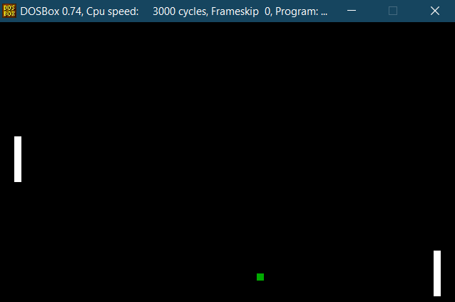

# PING-PONG-GAME

Ping Pong Game in 8086 Assembly Language 
<b>The PONG Game</b>

  

<b>Prerequisites:</b> 
Install DOSBox 0.74 in your system 
Create a folder named 8086(or any other name) in your C drive

<b>Running the game</b> 
-> open DOSBox 0.74.exe 
Run the followig commands: 
-> mount c C:\8086
-> masm PONG; Press enter 3 times 
-> link PONG; Press enter 3 times 
-> PONG 
 
<b>Playing the Game:</b> 
● Controlling the left paddle : Press 'w' or 'W' to move UP and 's' or 'S' to move DOWN. 
● Controlling the right paddle : Press 'o' or 'O' to move UP and 'l' or 'L' to move DOWN. 
● The ball will bounce back after colliding with any paddle or the top and bottom walls of the screen. 
● If the ball strikes the left or right wall of the screen it will start from the center of the screen. 
● It can be played by two people or only one person. 
Quitting the Game: 
● Press 'Esc' key to exit the game and go back to DOS. 

<b>Important functions and Interrupts used in the game:</b> 
Clearing the screen: 
● Interrupt used - INT 10H 
● INT 10h and AH = 00h - Set Video Mode 
● AL = 13h 320x200 256 color graphics (MCGA,VGA) - THIS IS THE VIDEO MODE USED 
 
Drawing a Pixel: 
● Interrupt used - INT 10H 
● AH = 0Ch - set the configuration to writing the pixel 
● AL = 0Fh - choose white as color of the pixel  
Checking Input from Keyboard: 
● Interrupt used INT 16H - Keyboard BIOS Services 
● AH = 01h - check if any key is being pressed (if not check the other paddle) 
● AH = 00h - check which key is being pressed (AL = ASCII Character)  
Moving the Paddles and Balls: 
● The velocities are added to the current positions of the paddles and the balls 
● the screen is cleared after the above operation for avoiding the formation of trails 

